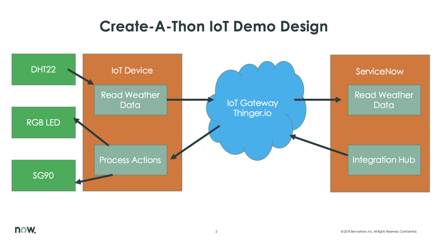
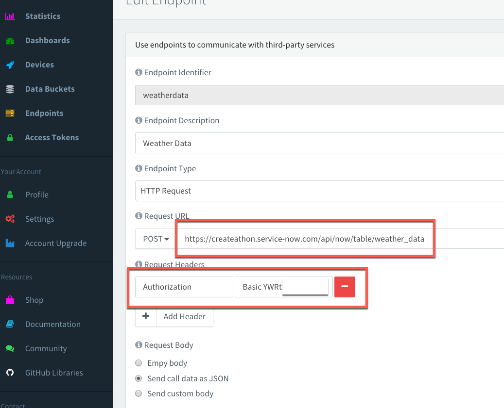
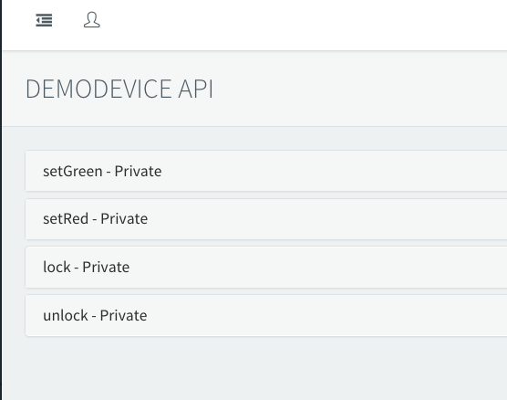
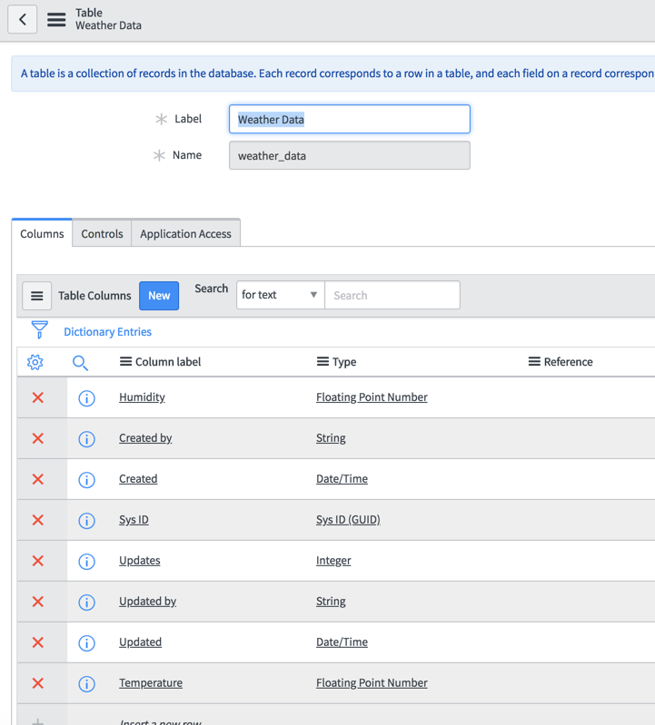
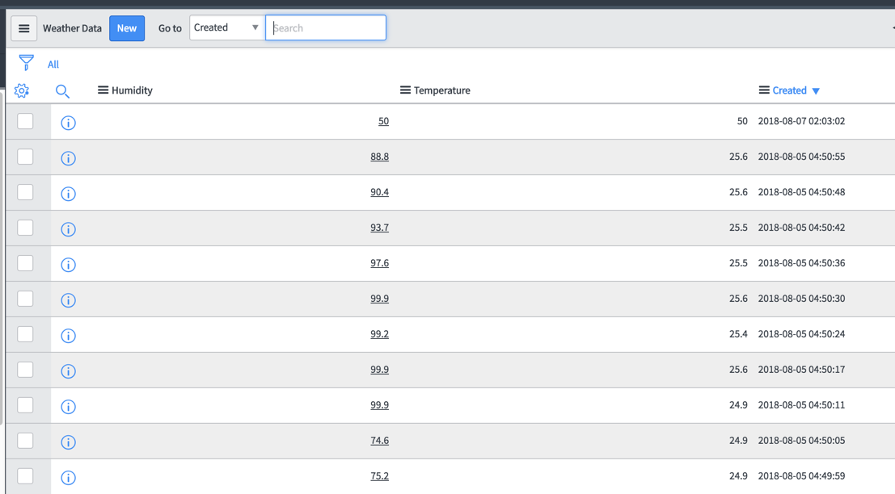
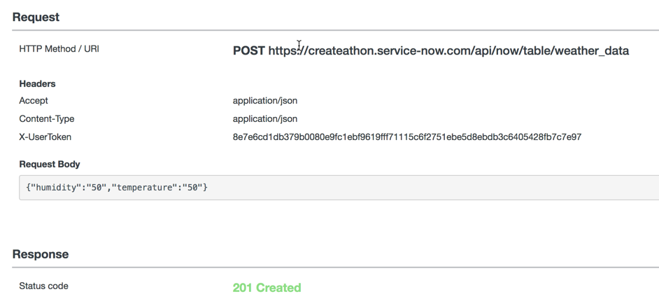
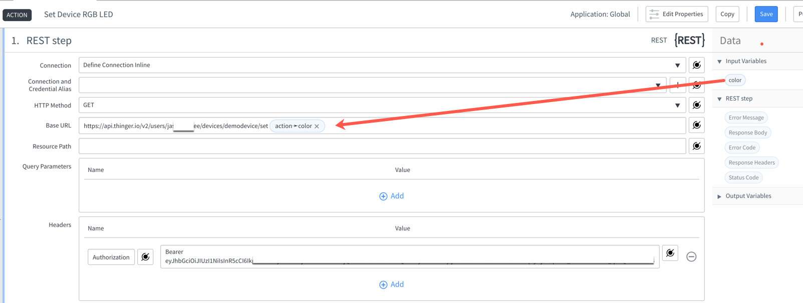
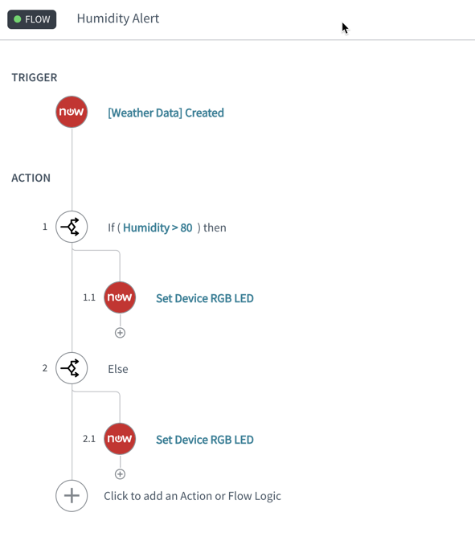

## CREATE-A-THON BootCamp IoT Demo

# Demo Objective
The objective of this demo is to showcase how IoT Devices can be integrated into the ServiceNow platform using the features like REST Services, IntegrationHub Flow Designer, REST step etc. 

The demo aims to read data from a real time temperature sensor, post the data to the ServiceNow instance. The data is persisted on ServiceNow on a table and separate IntegrationHub flows are written to trigger and act based on the humidity value sent by the IoT Device. 

# Hardware 
## Components used
1. Wemos D1 Mini ESP8266
1. DHT22 Temperature Module
1. WS2812B RGB Breakout
1. SG90 Servo
1. Jumper cables and connectors. 
   
   

# Software
## IoT Side Code
### Library required
1. Arduino IDE/Library
1. SimpleDHT
1. Board Manager -> Wemos D1 Mini ESP8266
1. AdaFruit NeoPixel
1. Thinger IO SDK 
   
### IoT Device code - INO File
Code available [here](TemperatureRGBSmartLock.ino)

### Design

## Thinger (IoT Gateway)
- Add a Device on Thinger 
- Add a Thinger Endpoint for the IoT device to call from IoT Device

- Check Device Endpoints automatically added as they are declared by IoT Code

## ServiceNow side Code

### Table
Two floating number columns - Temperature, Humidity. 

Some of the data captured by the device.

### REST API
Used POST to receive data from IoT Device via Thinger.io

### Flow Action

### Flow 

This demo shows how IoT devices can be integrated into ServiceNow platform and how the communication works bi-directionally. 